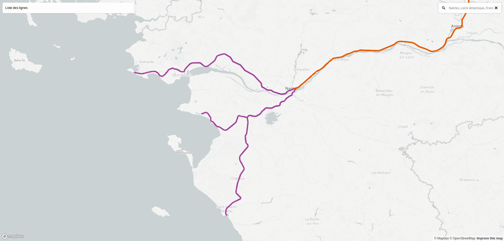

# index.html

Une carto des tracés de lignes.

Grands principes d'affichage :

Tracés :
* Contextualisation de l'importance des modes en fonction du niveau de zoom :
  * très dézoomé : juste les modes ferrés
  * niveau 10 et 12 (on voit toute la ville) : modes "lourds" (tout sauf bus) affichés, modes ferrés mais grisés
  * niveau 12 : modes lourds affichés. Les bus et les modes ferrés sont grisés (sans parallélisation)
  * au dela : on affiche tout sauf les modes ferrés
* Parallélisation des tracés des lignes : les lignes ne doivent pas se superposer
* Simplication des tracés en fonction du niveau de zoom :
  * quand on est très dézoomé, on n'a pas besoin du détail du rond-point (s'il est carré, c'est aussi bien. Voire on peut passer tout droit)
  * quand on a deux lignes parallèles (aller et retour) sur une ligne, il faut n'en garder qu'une
  * quand on a une ligne qui zig zag mais qu'on peut simplifier en ligne droite, ça peut être mieux
  * en plus, ça améliore perf de simplifier
* Réduire les croisements des lignes (en changeant le tri dans la parallélisation)
* Arrondir les angles (parce que les angles droits, c'est trop moche)

Arrêts :
* Contextualisation en fonction du niveau de zoom : afficher uniquement les arrêts principaux (gares, etc) quand on est très dézoomé, puis en ajouter petit à petit
* Afficher les correspondances entre les lignes
* À très fort niveau de zoom, ne plus afficher les tracés des lignes, mais juste les arrêts (emplacement d'attente voyageur) avec la liste des parcours desservis

# admin_level.html

Une carto interactive des zones administratives par niveau d'importance dans OSM.
